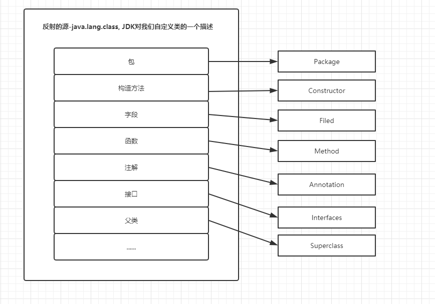
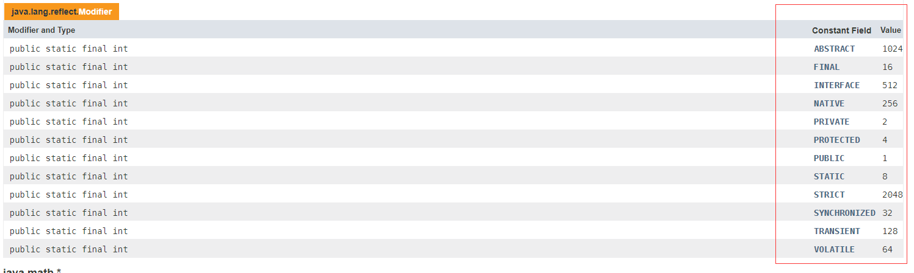

# 反射
指在java程序中运行状态中  
&emsp;&emsp;给定的一个类(Class)对象, 通过反射获取这个类(Class)对象的所有成员结构  
&emsp;&emsp;给定的一个具体的对象, 能够动态地调用它的方法及对任意属性值进行获取和赋值  
这种动态获取类的内容, 创建对象, 以及动态调用对象的方法及操作属性的机制  

优势  
&emsp;&emsp;增加程序的灵活性, 避免将固有的逻辑程序写死到代码里  
&emsp;&emsp;代码简洁, 可读性强, 可提高代码的服用率  
缺点  
&emsp;&emsp;相较直接调用在量大的情境下反射性能下降  
&emsp;&emsp;&emsp;Class.forName会调用-->forName0-->则是native方法-->调用native方法会用到JNI, JNI会带来性能损耗  
&emsp;&emsp;&emsp;newInstance会走checkMemberAccess判断权限安全之类, 也会带来性能问题  
&emsp;&emsp;存在一些内部暴露和安全隐患  

**反射的源**



访问修饰符所对应的状态码, 如果多种, 则状态码相加



获取对象的一些属性
```
            int modifiers = clazz.getModifiers(); //获取类的修饰符
            Package aPackage = clazz.getPackage(); //获取类的包名
            String name = clazz.getName(); //获取类的全路径名称
            String simpleName = clazz.getSimpleName(); //获取类的简单名称
            ClassLoader classLoader = clazz.getClassLoader(); //获取类的类加载器
            Class<?>[] interfaces = clazz.getInterfaces(); //获取类实现的接口列表
            Class<?> superclass = clazz.getSuperclass();    //获取类的父类
            Annotation[] annotations = clazz.getAnnotations(); //获取类的注解列表
```

获取对象的四种方式
```
    public static void main(String[] args) {
//        Class clazz = Dog.class;
//        Class clazz = new Dog().getClass();

        try {
//            Class clazz = Class.forName("com.gupao.fanshe.demo1.Dog");
            Class clazz = Main.class.getClassLoader().loadClass("com.gupao.fanshe.demo1.Dog");
        } catch (ClassNotFoundException e) {
            e.printStackTrace();
        }
    }
```

获取字段
```

```
