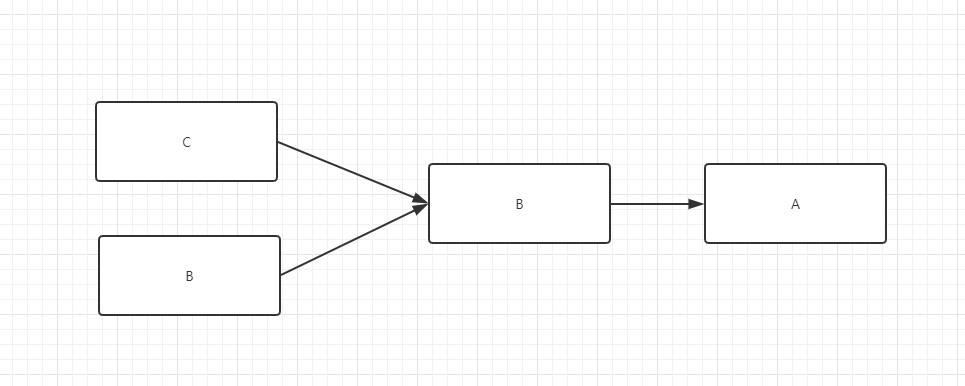

# Hystrix
服务雪崩是熔断器解决的最核心问题  
服务雪崩, 服务提供者不可用-->导致服务消费者的不可用-->导致不可用逐渐放大的一个过程-->最终导致服务瘫痪  
如图,服务间调用关系A-->B-->CD  

## Hystrix的三个机制
断路器机制    
&emsp;&emsp;当Hystrix Command 请求后端服务失败超过一个阈值比例(默认50%), 断路器就会切换到开路状态,  
所有的请求直接失败, 不会发送到后端服务  

Fallback  
&emsp;&emsp;降级回滚策略, 当服务不可用, 返回null或者缓存的数据, 避免返回异常, 给用户友好提示

资源隔离  
&emsp;&emsp;不同的微服务调用使用不同的线程池来管理  

